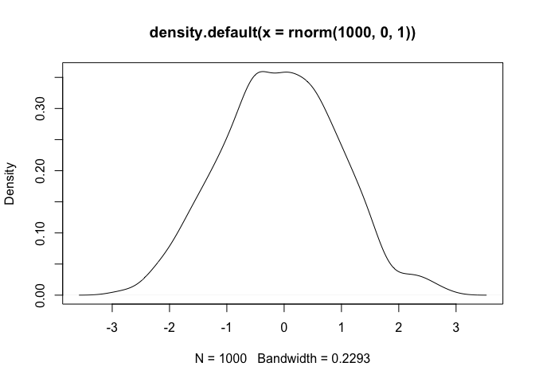

## What reprex provide

Describe your issue very briefly here. Then show it with a minimal,
self-contained example in the following R chunk.

    x <- 1
    y <- 2
    x + y

    ## [1] 3

Inline code is working? 2 Plot will be automatically uploaded to imgur.
Don’t know whether it is good or bad thing?

    plot(density(rnorm(1000, 0, 1)))

